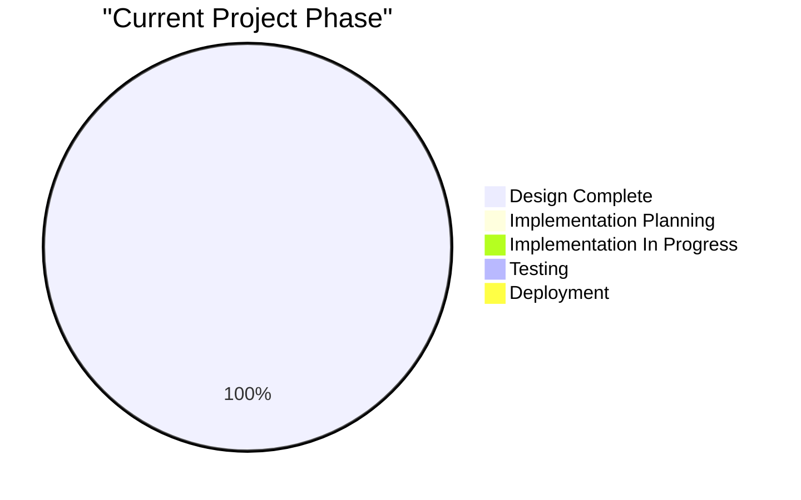
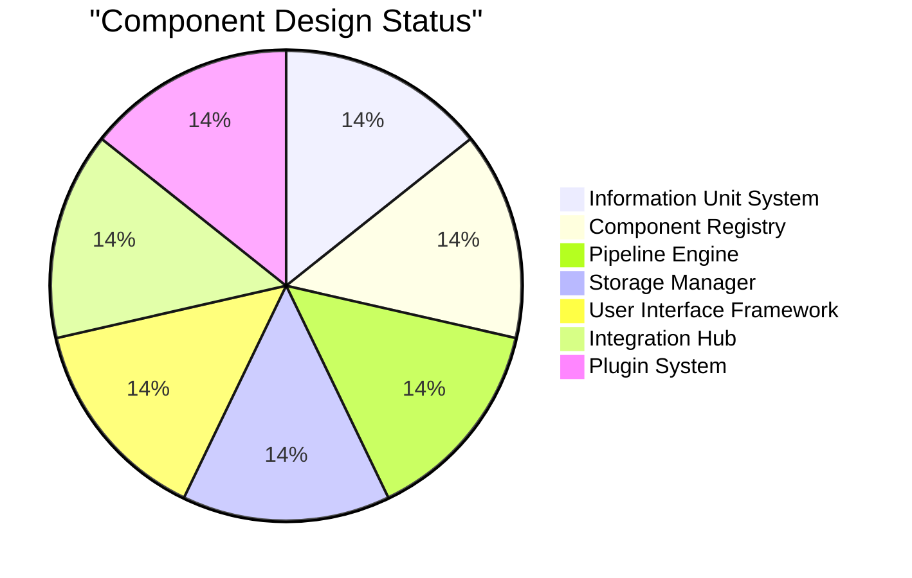
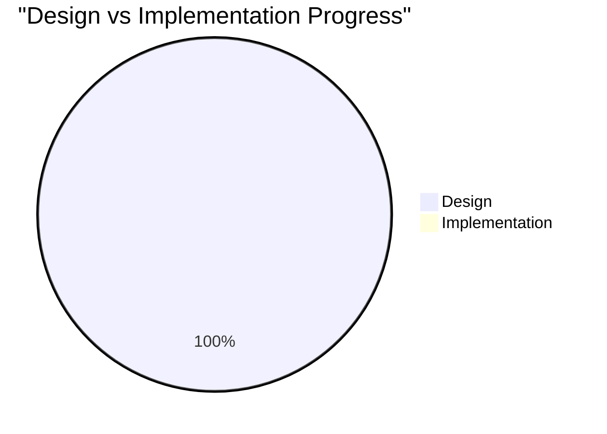
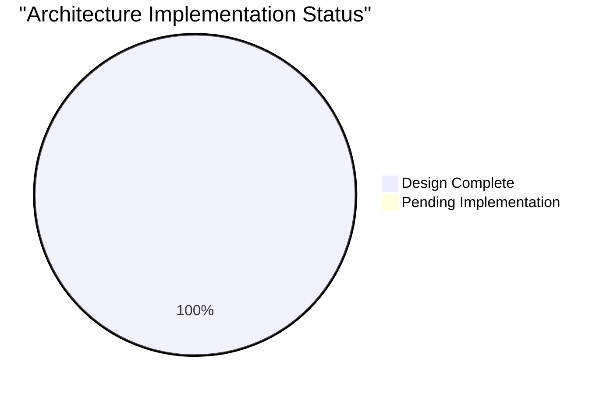
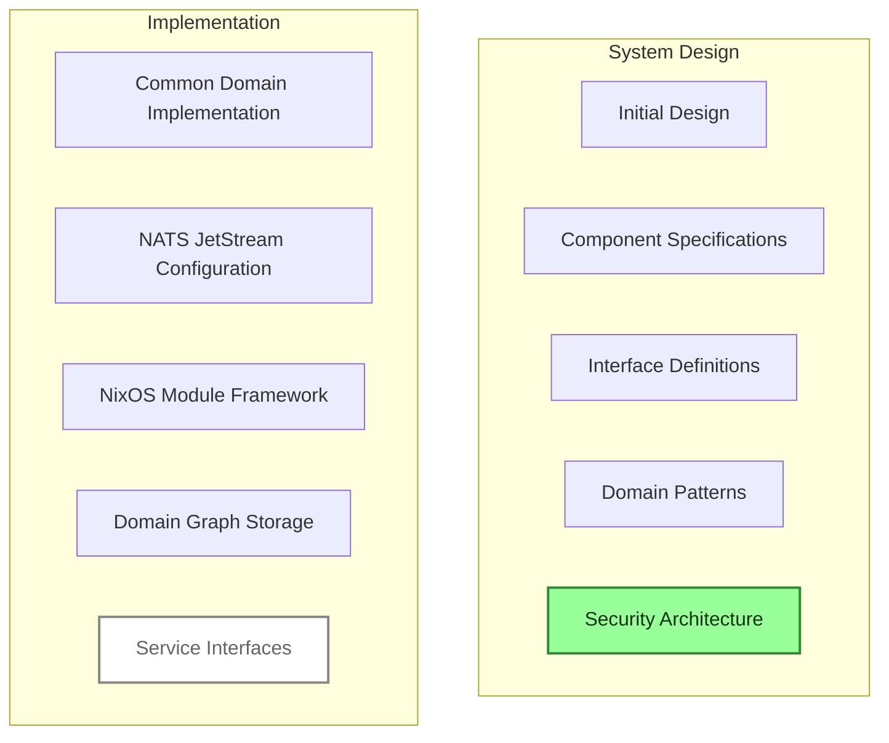
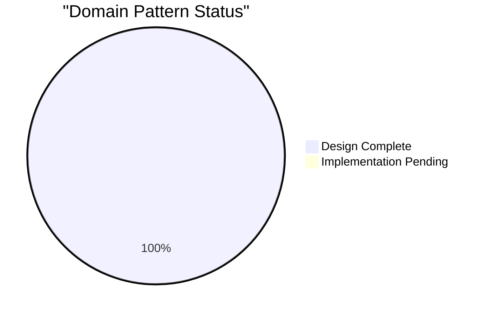
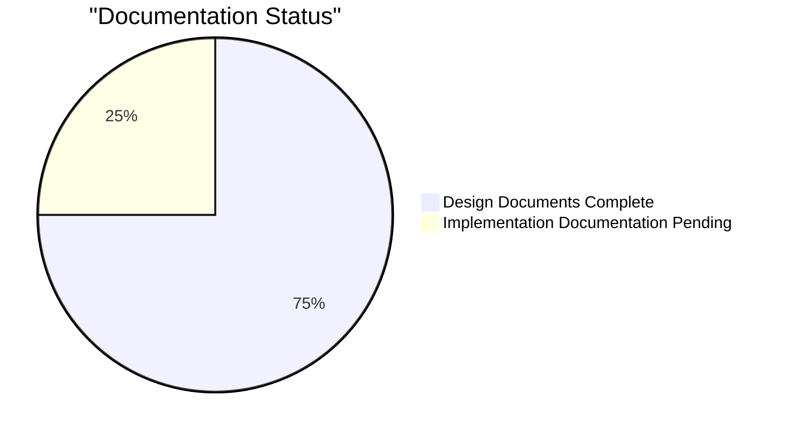

# CIM Project Dashboard

This dashboard provides a visual overview of the Composable Information Machine project progress, component status, and implementation timeline.

## Quick Links

- 📋 [Task List](../memory-bank/tasks.md) - Master list of all project tasks
- 📂 [Completed Tasks](../docs/archive/completed_tasks.md) - Archive of finished work
- 📝 [Design Decisions](../docs/notes/README.md) - Documented architecture decisions
- 🗂️ [Memory Bank](../memory-bank) - Project knowledge base
- 📊 [Domain Objects](../domain/README.md) - Domain object definitions
- 💼 [Private Lending Domain](../domain/vertical/private_lending.cypher) - Example vertical market implementation
- 💻 [IT Services Domain](../domain/vertical/it_services.cypher) - Example vertical market implementation

## Project Phase Status

## Component Status

## Implementation Readiness

## Architecture Implementation Status

## Current Milestone Status

## Domain Pattern Status

## Documentation Status

## Vertical Market Examples

| Vertical Market | Key Domain Objects | Implementation Status |
|-----------------|-------------------|------------------------|
| Private Lending | LoanApplication, PropertyAsset, PrivateLender, Borrower | ✅ Design Complete |
| IT Services     | ITService, ManagedCloudHosting, SoftwareDevelopment, BusinessIntegration | ✅ Design Complete |

## Domain Pattern Details

| Domain Pattern | Private Lending Example | IT Services Example |
|----------------|------------------------|---------------------|
| Information    | Loan Application       | Service Agreement   |
| Processing     | Loan Approval Workflow | Service Provisioning |
| Presentation   | Loan Dashboard         | Client Portal       |
| Integration    | Lender-Borrower Matching | System Integration |
| Metadata       | Collateral Attributes  | Service Level Definitions |
| Storage        | Secure Loan Documents  | Configuration Management |
| Security       | Lender Verification    | Client Authentication |
| Extensibility  | Custom Lending Criteria| Service Customization |
| Notification   | Loan Status Updates    | Service Alerts      |

## Key Metrics

| Metric | Value | Status |
|--------|-------|--------|
| Design Decisions Documented | 15 | ✅ Complete |
| Core Components Designed | 7 | ✅ Complete |
| Domain Patterns Defined | 9 | ✅ Complete |
| Domain Objects Defined | 2+ | ✅ Initial Set Complete |
| Vertical Markets Modeled | 2 | ✅ Initial Examples Complete |
| Implementation Tasks | 0/7 | 🔄 Not Started |
| Documentation Tasks | 1/5 | 🔄 In Progress |

## Next Implementation Priorities

1. Common Domain Implementation
2. NATS JetStream Configuration
3. NixOS Module Framework
4. Domain Graph Storage Implementation
5. Service Interfaces and MCP Integration

*Last Updated: Q1 2025 - Transitioning from Design to Implementation Phase* 