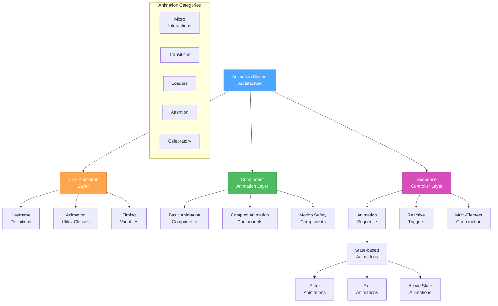

# Animation Patterns - Creative Phase

🎨🎨🎨 ENTERING CREATIVE PHASE: UI/UX DESIGN 🎨🎨🎨
Focus: Animation Patterns
Objective: Define a comprehensive animation system that enhances the UI with meaningful motion while maintaining performance and accessibility
Requirements:
- Must align with the established visual theme (Futuristic minimalism, cybernetic)
- Must work efficiently with Leptos and WebAssembly
- Must support graceful degradation for reduced motion preferences
- Must enhance UX without hindering performance
- Must provide clear implementation guidelines for developers

## PROBLEM STATEMENT

The project requires a systematic approach to animations that enhances user experience, communicates state changes, and reinforces the futuristic cybernetic aesthetic. We need to establish consistent animation patterns that can be applied across the application while ensuring optimal performance and accessibility. These patterns must be implementable in Rust/Leptos and work seamlessly with the previously defined component style specifications.

## OPTIONS ANALYSIS

### Option 1: CSS-Only Animation System
**Description**: Implement animations exclusively through CSS transitions, keyframes, and animations, managing them with Tailwind classes and custom CSS.
**Pros**:
- Simpler implementation with standard web technologies
- Better performance for simple animations by utilizing GPU acceleration
- Easier to integrate with the Tailwind component style system
- Better browser compatibility and fallback support
**Cons**:
- Limited control for complex sequence coordination
- More challenging to create data-driven animations
- Difficult to implement physics-based animations
- Less integration with Leptos reactive state system
**Complexity**: Low to Medium
**Implementation Time**: Low

### Option 2: Leptos-Integrated Animation System
**Description**: Create a custom animation system that tightly integrates with Leptos signals and reactive state, using Rust for animation logic and CSS for rendering.
**Pros**:
- Direct integration with application state
- More control over animation triggers based on data changes
- Better coordination between multiple animated elements
- Consistent timing between state changes and visual updates
**Cons**:
- Higher implementation complexity
- Potentially higher CPU usage for complex animations
- More code to maintain
- Steeper learning curve for developers
**Complexity**: High
**Implementation Time**: High

### Option 3: Hybrid Approach with Animation Primitives
**Description**: Create a library of animation primitives that combine CSS for rendering and Leptos signals for control, with predefined patterns that can be easily applied to components.
**Pros**:
- Balance between performance and flexibility
- Consistent animation patterns throughout the application
- Reusable animation components
- Leverage both CSS performance and Leptos reactivity
**Cons**:
- Requires careful architecture to prevent performance issues
- More complex than pure CSS
- Needs clear documentation for proper usage
- Potential for misuse if not well-structured
**Complexity**: Medium
**Implementation Time**: Medium

### Option 4: SVG-Focused Animation Framework
**Description**: Develop a specialized framework for SVG animations that leverages the project's graph visualization needs, with integration for both UI and data visualization.
**Pros**:
- Unified approach for both UI and data visualization animations
- Better control over complex path animations
- Resolution-independent animations that scale well
- Potential for more unique and branded animation styles
**Cons**:
- More specialized and potentially limited for general UI animations
- Higher complexity for simpler UI transitions
- Potentially higher resource usage
- Less integration with existing Tailwind components
**Complexity**: High
**Implementation Time**: High

## DECISION

After evaluating all options, we recommend **Option 3: Hybrid Approach with Animation Primitives** for the following reasons:

1. It balances performance and flexibility better than other approaches
2. It allows for tight integration with Leptos reactive state where needed
3. It leverages CSS performance benefits for simpler animations
4. It supports creating a consistent animation language across the application
5. It provides clear patterns that maintain the design aesthetic
6. It accommodates both simple transitions and complex sequences
7. It offers a reasonable implementation timeline

This approach will enable us to create performance-optimized animations while still providing the flexibility needed for more complex interactions and data-driven animations.

## IMPLEMENTATION PLAN

### 1. Animation Timing System

Define core animation variables in Tailwind configuration:

```js
// In tailwind.config.js
theme: {
  extend: {
    transitionDuration: {
      'micro': '150ms',
      'standard': '250ms',
      'emphasis': '400ms',
      'dramatic': '800ms',
      'background': '2000ms',
    },
    transitionTimingFunction: {
      'standard': 'cubic-bezier(0.33, 1, 0.68, 1)',
      'energetic': 'cubic-bezier(0.22, 1, 0.36, 1)',
      'exit': 'cubic-bezier(0.64, 0, 0.78, 0)',
      'bounce': 'cubic-bezier(0.34, 1.56, 0.64, 1)',
      'dramatic': 'cubic-bezier(0.76, 0, 0.24, 1)',
    }
  }
}
```

### 2. CSS Animation Primitives

Create a base set of animation keyframes and utility classes:

```css
/* In animations.css */
@keyframes fadeIn {
  from { opacity: 0; }
  to { opacity: 1; }
}

@keyframes fadeOut {
  from { opacity: 1; }
  to { opacity: 0; }
}

@keyframes slideInUp {
  from { transform: translateY(20px); opacity: 0; }
  to { transform: translateY(0); opacity: 1; }
}

@keyframes glow {
  0%, 100% { box-shadow: 0 0 5px 2px rgba(0, 156, 255, 0.6); }
  50% { box-shadow: 0 0 15px 5px rgba(0, 156, 255, 0.8); }
}

@keyframes pulse {
  0%, 100% { opacity: 1; }
  50% { opacity: 0.5; }
}

@keyframes shimmer {
  0% { background-position: -100% 0; }
  100% { background-position: 100% 0; }
}

/* Animation utility classes */
.animate-fade-in {
  animation: fadeIn var(--duration-standard) var(--ease-standard) forwards;
}

.animate-slide-up {
  animation: slideInUp var(--duration-standard) var(--ease-energetic) forwards;
}

.animate-glow {
  animation: glow var(--duration-dramatic) var(--ease-standard) infinite;
}

.animate-pulse {
  animation: pulse var(--duration-emphasis) var(--ease-standard) infinite;
}

.animate-shimmer {
  background: linear-gradient(
    90deg,
    rgba(255,255,255,0) 0%,
    rgba(176,246,255,0.5) 50%,
    rgba(255,255,255,0) 100%
  );
  background-size: 200% 100%;
  animation: shimmer var(--duration-background) infinite;
}
```

### 3. Leptos Animation Components

Create Rust components that encapsulate animation logic:

```rust
// Example pseudo-code for a FadeIn component
#[component]
pub fn FadeIn(
    #[prop(default = "standard")] duration: &'static str,
    #[prop(default = "standard")] easing: &'static str,
    #[prop(default = 0)] delay: u32,
    #[prop(default = false)] show: bool,
    children: Children,
) -> impl IntoView {
    let duration_class = match duration {
        "micro" => "duration-micro",
        "standard" => "duration-standard",
        "emphasis" => "duration-emphasis",
        "dramatic" => "duration-dramatic",
        _ => "duration-standard",
    };
    
    let easing_class = match easing {
        "standard" => "ease-standard",
        "energetic" => "ease-energetic",
        "exit" => "ease-exit",
        "bounce" => "ease-bounce",
        "dramatic" => "ease-dramatic",
        _ => "ease-standard",
    };
    
    let delay_style = if delay > 0 {
        format!("animation-delay: {}ms;", delay)
    } else {
        String::new()
    };
    
    let show_signal = create_signal(show);
    
    view! {
        <div
            class={move || {
                format!(
                    "transition-opacity {} {} {}",
                    duration_class,
                    easing_class,
                    if show_signal.get() { "opacity-100" } else { "opacity-0" }
                )
            }}
            style={delay_style}
        >
            {children()}
        </div>
    }
}
```

### 4. Animation Sequence Controller

Create a Rust utility for coordinating complex animation sequences:

```rust
// Example pseudo-code for an animation sequence controller
pub struct AnimationSequence {
    steps: Vec<AnimationStep>,
    current_step: RwSignal<usize>,
}

struct AnimationStep {
    duration: u32,
    on_start: Box<dyn Fn()>,
    on_complete: Box<dyn Fn()>,
}

impl AnimationSequence {
    pub fn new() -> Self {
        Self {
            steps: Vec::new(),
            current_step: create_rw_signal(0),
        }
    }
    
    pub fn add_step(&mut self, duration: u32, on_start: impl Fn() + 'static, on_complete: impl Fn() + 'static) {
        self.steps.push(AnimationStep {
            duration,
            on_start: Box::new(on_start),
            on_complete: Box::new(on_complete),
        });
    }
    
    pub fn play(&self) {
        let steps = self.steps.clone();
        let current = self.current_step;
        
        create_effect(move |_| {
            let step_index = current.get();
            if step_index >= steps.len() {
                return;
            }
            
            let step = &steps[step_index];
            (step.on_start)();
            
            set_timeout(move || {
                (step.on_complete)();
                current.update(|val| *val += 1);
            }, Duration::from_millis(step.duration.into()));
        });
    }
}
```

### 5. Reduced Motion Implementation

Create utilities for respecting user motion preferences:

```rust
// Example pseudo-code for respecting reduced motion preferences
pub fn use_reduced_motion() -> ReadSignal<bool> {
    let prefers_reduced = create_signal(false);
    
    create_effect(move |_| {
        // Check if the mediaQuery for prefers-reduced-motion exists and matches
        if window()
            .match_media("(prefers-reduced-motion: reduce)")
            .unwrap()
            .matches()
        {
            prefers_reduced.set(true);
        }
        
        // Set up listener for changes
        let media_query = window().match_media("(prefers-reduced-motion: reduce)").unwrap();
        let closure = Closure::wrap(Box::new(move |e: web_sys::MediaQueryListEvent| {
            prefers_reduced.set(e.matches());
        }) as Box<dyn FnMut(_)>);
        
        media_query.add_listener_with_callback("change", closure.as_ref().unchecked_ref()).unwrap();
        closure.forget();
    });
    
    prefers_reduced.into()
}

// Component that respects reduced motion preferences
#[component]
pub fn MotionSafe(
    #[prop(default = true)] animate: bool,
    #[prop(default = "standard")] duration: &'static str,
    #[prop(default = "standard")] easing: &'static str,
    alternative_view: Option<Children>,
    children: Children,
) -> impl IntoView {
    let reduced_motion = use_reduced_motion();
    
    view! {
        {move || {
            if reduced_motion.get() {
                if let Some(alt) = &alternative_view {
                    alt()
                } else {
                    view! { <div class="transition-none">{children()}</div> }
                }
            } else {
                view! {
                    <FadeIn
                        show={animate}
                        duration={duration}
                        easing={easing}
                    >
                        {children()}
                    </FadeIn>
                }
            }
        }}
    }
}
```

### 6. Animation Pattern Documentation

Create a comprehensive guide for animation usage:

1. **Animation Timing Reference**
   - Micro interactions: 150ms
   - Standard transitions: 250ms
   - Emphasis animations: 400ms
   - Dramatic animations: 800ms
   - Background animations: 2000-4000ms

2. **Animation Type Guidelines**
   - State changes (hover, active, focus)
   - Transitions between views
   - Loading and progress indicators
   - Attention-directing animations
   - Celebratory animations

3. **Implementation Pattern Examples**
   - Code snippets for common scenarios
   - Component integration examples
   - Sequence coordination examples

## VISUALIZATION



## DETAILED ANIMATION SPECIFICATIONS

### Micro-Interactions

#### Button Hover Animation
- **Type**: State change animation
- **Duration**: 150ms (micro)
- **Timing**: ease-standard (cubic-bezier(0.33, 1, 0.68, 1))
- **Properties**:
  - Primary button: Scale to 1.05, increase shadow glow
  - Secondary button: Gradient shimmer effect
- **CSS Implementation**:
```css
.btn-primary {
  @apply transition-all duration-micro ease-standard hover:scale-105 hover:shadow-[0_0_12px_4px_#009CFF];
}

.btn-secondary {
  @apply transition-all duration-micro ease-standard hover:bg-gradient-to-r hover:from-[#FDFEFF] hover:to-[#B0B0B0]/40;
}
```

#### Input Focus Animation
- **Type**: State change animation
- **Duration**: 200ms (micro)
- **Timing**: ease-energetic (cubic-bezier(0.22, 1, 0.36, 1))
- **Properties**: Border color change, subtle background shift
- **CSS Implementation**:
```css
.input-field {
  @apply transition-all duration-micro ease-energetic focus:border-[#009CFF] focus:ring-1 focus:ring-[#009CFF] focus:bg-white/50;
}
```

### Transitions

#### Page Transition
- **Type**: Route change animation
- **Duration**: 400ms (emphasis)
- **Timing**: ease-energetic (cubic-bezier(0.22, 1, 0.36, 1))
- **Properties**: Fade out, fade in with slide up
- **CSS & Leptos Implementation**:
```rust
// Pseudo-code for page transition
#[component]
pub fn PageTransition(children: Children) -> impl IntoView {
    let location = use_location();
    let key = create_memo(move |_| location.pathname.get());
    
    view! {
        <TransitionGroup>
            <Transition
                key={key}
                enter="duration-emphasis ease-energetic transform"
                enter_from="opacity-0 translate-y-4"
                enter_to="opacity-100 translate-y-0"
                leave="duration-standard ease-exit transform"
                leave_from="opacity-100"
                leave_to="opacity-0"
            >
                {children()}
            </Transition>
        </TransitionGroup>
    }
}
```

#### Modal Animation
- **Type**: Component appearance/disappearance
- **Duration**: 300ms (standard)
- **Timing**: 
  - Enter: ease-bounce (cubic-bezier(0.34, 1.56, 0.64, 1))
  - Exit: ease-exit (cubic-bezier(0.64, 0, 0.78, 0))
- **Properties**: Scale and fade for modal, fade for overlay
- **CSS & Leptos Implementation**:
```rust
// Pseudo-code for modal animation
#[component]
pub fn Modal(#[prop(default = false)] show: bool, children: Children) -> impl IntoView {
    let show_signal = create_signal(show);
    
    view! {
        <div
            class={move || {
                format!(
                    "fixed inset-0 bg-black/50 transition-opacity duration-standard ease-standard {}",
                    if show_signal.get() { "opacity-100" } else { "opacity-0 pointer-events-none" }
                )
            }}
        >
            <div
                class={move || {
                    format!(
                        "bg-white/30 backdrop-blur-md p-6 rounded-lg shadow-xl border border-[#B0B0B0] transition-all duration-standard transform {}",
                        if show_signal.get() { 
                            "opacity-100 scale-100 ease-bounce" 
                        } else { 
                            "opacity-0 scale-95 ease-exit pointer-events-none" 
                        }
                    )
                }}
            >
                {children()}
            </div>
        </div>
    }
}
```

### Loading Animations

#### Spinner Animation
- **Type**: Loading indicator
- **Duration**: 1500ms (continuous)
- **Timing**: Linear
- **Properties**: Rotation with pulsing blue glow
- **CSS Implementation**:
```css
@keyframes spin {
  0% { transform: rotate(0deg); }
  100% { transform: rotate(360deg); }
}

@keyframes pulse-glow {
  0%, 100% { box-shadow: 0 0 5px 2px rgba(0, 156, 255, 0.6); }
  50% { box-shadow: 0 0 15px 5px rgba(0, 156, 255, 0.8); }
}

.spinner {
  @apply w-8 h-8 border-2 border-t-transparent border-[#009CFF] rounded-full;
  animation: spin 1.5s linear infinite, pulse-glow 2s ease-in-out infinite;
}
```

#### Progress Bar Animation
- **Type**: Progress indicator
- **Duration**: Varies based on process
- **Timing**: ease-standard
- **Properties**: Width transition with shimmer effect overlay
- **CSS & Leptos Implementation**:
```rust
// Pseudo-code for progress bar
#[component]
pub fn ProgressBar(#[prop(default = 0)] progress: f64) -> impl IntoView {
    let progress_signal = create_signal(progress);
    
    view! {
        <div class="h-2 bg-white/30 rounded-full overflow-hidden">
            <div 
                class="h-full bg-[#009CFF] transition-all duration-standard ease-standard relative"
                style={move || format!("width: {}%", progress_signal.get() * 100.0)}
            >
                <div class="absolute inset-0 animate-shimmer"></div>
            </div>
        </div>
    }
}
```

### Attention-Directing Animations

#### Notification Appearance
- **Type**: Alert animation
- **Duration**: 300ms (standard)
- **Timing**: ease-energetic
- **Properties**: Slide in from top with fade
- **CSS & Leptos Implementation**:
```rust
// Pseudo-code for notification animation
#[component]
pub fn Notification(
    #[prop(default = false)] show: bool,
    #[prop(default = "info")] variant: &'static str,
    message: String,
) -> impl IntoView {
    let show_signal = create_signal(show);
    
    let variant_class = match variant {
        "success" => "border-l-4 border-l-[#00E1FF] bg-[#00E1FF]/10",
        "error" => "border-l-4 border-l-[#FF3366] bg-[#FF3366]/10",
        "info" => "border-l-4 border-l-[#009CFF] bg-[#009CFF]/10",
        "warning" => "border-l-4 border-l-[#FFB347] bg-[#FFB347]/10",
        _ => "border-l-4 border-l-[#009CFF] bg-[#009CFF]/10",
    };
    
    view! {
        <div
            class={move || {
                format!(
                    "fixed top-4 right-4 p-4 rounded-md shadow-lg {} transition-all duration-standard ease-energetic transform {}",
                    variant_class,
                    if show_signal.get() { 
                        "translate-y-0 opacity-100" 
                    } else { 
                        "-translate-y-4 opacity-0 pointer-events-none" 
                    }
                )
            }}
        >
            {message}
        </div>
    }
}
```

#### Highlight Animation
- **Type**: Attention drawer
- **Duration**: 800ms (dramatic)
- **Timing**: ease-dramatic (cubic-bezier(0.76, 0, 0.24, 1))
- **Properties**: Pulse glow effect that fades out
- **CSS Implementation**:
```css
@keyframes highlight-pulse {
  0% { box-shadow: 0 0 0 0 rgba(0, 156, 255, 0); }
  30% { box-shadow: 0 0 0 4px rgba(0, 156, 255, 0.8); }
  100% { box-shadow: 0 0 0 8px rgba(0, 156, 255, 0); }
}

.highlight-element {
  animation: highlight-pulse 800ms cubic-bezier(0.76, 0, 0.24, 1) forwards;
}
```

### Data Visualization Animations

#### Graph Node Animation
- **Type**: Interactive element
- **Duration**: 300ms (standard)
- **Timing**: ease-bounce
- **Properties**: Scale and glow on hover, pulse on selection
- **CSS Implementation**:
```css
.graph-node {
  @apply transition-all duration-standard ease-standard;
}

.graph-node:hover {
  @apply scale-110 shadow-[0_0_8px_2px_#009CFF];
  transition-timing-function: cubic-bezier(0.34, 1.56, 0.64, 1);
}

.graph-node.selected {
  @apply animate-pulse shadow-[0_0_12px_4px_#009CFF];
}
```

#### Data Entry Animation
- **Type**: Data visualization animation
- **Duration**: Staggered, 200ms per item (standard)
- **Timing**: ease-energetic
- **Properties**: Fade in with slide up, staggered for each data point
- **Leptos Implementation**:
```rust
// Pseudo-code for data visualization entry animation
#[component]
pub fn DataVisualization<T>(items: Vec<T>) -> impl IntoView {
    view! {
        <div class="data-container">
            {items.into_iter().enumerate().map(|(index, item)| {
                let delay = index as u32 * 50; // 50ms stagger
                
                view! {
                    <div 
                        class="opacity-0 translate-y-4"
                        style={format!("animation: slideInUp 200ms cubic-bezier(0.22, 1, 0.36, 1) {}ms forwards", delay)}
                    >
                        // Render data point
                    </div>
                }
            }).collect::<Vec<_>>()}
        </div>
    }
}
```

## ACCESSIBILITY CONSIDERATIONS

To ensure animations are accessible to all users:

1. **Respect User Preferences**
   - Implement the `prefers-reduced-motion` media query
   - Provide alternative static views for users who prefer reduced motion
   - For critical animations, provide minimal versions rather than removing entirely

2. **Prevent Vestibular Disorders Triggers**
   - Avoid large moving elements that occupy significant screen space
   - Minimize parallax effects
   - Avoid rapid flashing (3 flashes/second or more)
   - Use subtle motion for most UI elements

3. **Maintain Focus Management**
   - Ensure animated elements maintain proper focus states
   - Don't remove elements from the DOM during animations in a way that disrupts focus
   - Ensure keyboard navigation works with animated components

4. **Animation Fail-safes**
   - Implement timeouts for animations that don't complete
   - Ensure functionality works even if animations fail
   - Provide static fallbacks for all animated content

## PERFORMANCE CONSIDERATIONS

To maintain optimal performance:

1. **Animation Property Selection**
   - Prefer animating transform and opacity (GPU-accelerated properties)
   - Avoid animating properties that cause layout recalculations (width, height, top, left)
   - Use `will-change` sparingly for complex animations

2. **Resource Management**
   - Reduce or pause background animations when not in viewport
   - Throttle animations during scrolling
   - Implement adaptive animation complexity based on device performance

3. **Testing Methodology**
   - Test animations on low-power devices
   - Measure and set frame rate thresholds (target 60fps)
   - Implement performance monitoring for animations

🎨 CREATIVE CHECKPOINT: Animation System Design

The animation specifications establish a comprehensive system that:
- Creates a consistent animation language across the application
- Balances performance with expressiveness
- Integrates tightly with both CSS and Leptos
- Respects user preferences and accessibility needs
- Scales from micro-interactions to complex sequences

## INTEGRATION WITH COMPONENT STYLE SYSTEM

The animation system is designed to work seamlessly with the previously established component style specifications:

1. **Naming Convention Alignment**
   - Animation class names follow the same patterns as component classes
   - Timing variables use the same scale terminology

2. **CSS Integration**
   - Animations leverage the same color values defined in the component styles
   - Animation utility classes can be composed with component classes

3. **Shared Implementation Approach**
   - Similar to component styles, animations use a hybrid of Tailwind utilities and custom CSS
   - The same balance between flexibility and consistency is maintained

4. **Documentation Synergy**
   - Animation documentation follows the same format as component documentation
   - Cross-references between component and animation documentation are provided

🎨🎨🎨 EXITING CREATIVE PHASE - DECISION MADE 🎨🎨🎨

Summary: We've created a comprehensive animation pattern system using a hybrid approach that combines CSS animations with Leptos integration, establishing a flexible yet consistent animation language that enhances the user experience while maintaining performance and accessibility.

Key Decisions:
1. Adopt a hybrid animation approach combining CSS primitives with Leptos components
2. Define a consistent timing system for animations across the application
3. Create modular, reusable animation components with accessibility support
4. Implement a sequence controller for complex animation orchestration
5. Ensure proper reduced motion support throughout the system

Next Steps:
1. Implement the animation timing system in the Tailwind configuration
2. Create the base CSS animation primitives
3. Develop the core Leptos animation components
4. Implement the animation sequence controller
5. Create examples of the animation patterns for developer reference
6. Document integration with the component style system 