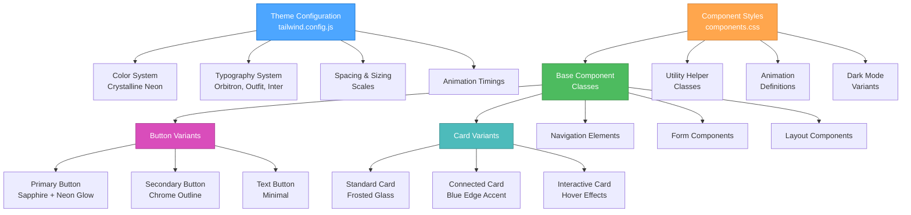

# Component Style Specifications - Creative Phase

🎨🎨🎨 ENTERING CREATIVE PHASE: UI/UX DESIGN 🎨🎨🎨
Focus: Component Style Specifications
Objective: Define a comprehensive styling system for UI components that ensures consistency, accessibility, and alignment with the design aesthetic
Requirements:
- Must align with the established visual theme (Futuristic minimalism, cybernetic)
- Must be implementable with TailwindCSS
- Must support both light and dark themes
- Must ensure accessibility compliance
- Must provide clear implementation guidelines for developers

## PROBLEM STATEMENT

The project requires a consistent, scalable, and well-documented approach to component styling that maintains the futuristic and cybernetic aesthetic while ensuring usability and accessibility. We need to establish clear guidelines for how each UI component should be styled, with specific implementation details that can be consistently applied across the application.

## OPTIONS ANALYSIS

### Option 1: Tailwind Utility-Only Approach
**Description**: Style components using only Tailwind's utility classes directly in component templates with no custom CSS.
**Pros**:
- Simple implementation with minimal setup
- Direct mapping between markup and styles
- Faster initial development without context switching
- Easy responsive adjustments with built-in breakpoint utilities
**Cons**:
- Can lead to verbose markup with many utility classes
- Style consistency may be harder to maintain across components
- May require repeated class patterns for recurring elements
- Limited ability to create complex animations and effects
**Complexity**: Low
**Implementation Time**: Low

### Option 2: Tailwind Component Classes + @apply
**Description**: Create custom component classes using Tailwind's @apply directive to compose utility classes into reusable patterns.
**Pros**:
- Cleaner markup with fewer utility classes
- Better maintainability through centralized style definitions
- Easier to achieve consistency across components
- Still leverages Tailwind's utility system
**Cons**:
- Requires additional CSS files for component classes
- Can obscure the relationship between markup and applied styles
- May lead to unnecessary abstraction if overused
- Potentially larger CSS output if not carefully managed
**Complexity**: Medium
**Implementation Time**: Medium

### Option 3: Tailwind Plugin with Custom Theme
**Description**: Extend Tailwind through a custom plugin that defines component styles and theme variables programmatically.
**Pros**:
- Powerful control over component theming
- Can define complex variants and states systematically
- Enables dynamic theme generation for light/dark modes
- Keeps all theme logic in one place
**Cons**:
- More complex setup and configuration
- Higher learning curve for team members
- May require more advanced Tailwind knowledge
- Could complicate the build process
**Complexity**: High
**Implementation Time**: High

### Option 4: CSS-in-JS with Tailwind Values
**Description**: Use a CSS-in-JS approach that references Tailwind theme values but allows for more programmatic styling.
**Pros**:
- Full programmatic control over styles
- Better encapsulation of component-specific styles
- Can dynamically adjust styles based on props or state
- Can simplify complex animations and effects
**Cons**:
- Introduces additional dependencies
- Moves away from Tailwind's utility-first approach
- May complicate the build process
- Potentially higher runtime overhead
**Complexity**: High
**Implementation Time**: High

## DECISION

After evaluating all options, we recommend **Option 2: Tailwind Component Classes + @apply** for the following reasons:

1. It strikes a balance between the simplicity of utility classes and the maintainability of component abstractions
2. It keeps markup clean while still leveraging Tailwind's utility system
3. It provides better consistency enforcement for the design system
4. It allows for centralized theme management while remaining within the Tailwind ecosystem
5. It supports both light and dark themes through Tailwind's theme system
6. The learning curve is moderate and accessible to the team

This approach will allow us to create reusable, consistent component styles while maintaining the flexibility to customize individual instances when needed.

## IMPLEMENTATION PLAN

### 1. Theme Configuration

Create a `tailwind.config.js` file with custom theme variables for:
- Colors (using the Crystalline Neon palette)
- Typography (Orbitron, Outfit, Inter, JetBrains Mono)
- Spacing and sizing scales
- Animation timings
- Shadow definitions
- Border radius values

### 2. Base Component Styles

Create a `components.css` file with base component styles using @apply:

```css
/* Button styles */
.btn {
  @apply px-4 py-2 rounded font-medium transition-all duration-300;
}

.btn-primary {
  @apply btn bg-[#0033CC] text-[#FDFEFF] shadow-[0_0_8px_2px_#009CFF] hover:shadow-lg hover:scale-105;
}

.btn-secondary {
  @apply btn border border-[#B0B0B0] hover:bg-gradient-to-r hover:from-[#FDFEFF] hover:to-[#B0B0B0]/40;
}

/* Card styles */
.glass-card {
  @apply bg-white/30 backdrop-blur-md shadow-xl border border-[#B0B0B0] rounded-lg p-6 transition-all duration-300;
}

.glass-card-connected {
  @apply glass-card border-l-4 border-l-[#00B0FF];
}

/* Continue with other components... */
```

### 3. Dark Mode Implementation

Configure dark mode variants with Tailwind's dark mode system:

```css
.glass-card {
  @apply bg-white/30 backdrop-blur-md shadow-xl border border-[#B0B0B0] rounded-lg p-6 dark:bg-[#121A28]/80 dark:border-[#4A5A6A];
}
```

### 4. Animation Utilities

Create custom animations for microinteractions:

```css
@keyframes glow {
  0%, 100% { box-shadow: 0 0 5px 2px rgba(0, 156, 255, 0.6); }
  50% { box-shadow: 0 0 15px 5px rgba(0, 156, 255, 0.8); }
}

.animate-glow {
  animation: glow 2s ease-in-out infinite;
}
```

### 5. Accessibility Utilities

Add utilities for focus states and screen reader content:

```css
.focus-visible {
  @apply outline-none ring-2 ring-[#009CFF] ring-offset-2;
}

.sr-only {
  @apply absolute w-px h-px p-0 -m-px overflow-hidden;
}
```

### 6. Component Style Documentation

Create a component style reference document with:
- Visual examples of each component
- Class reference and usage patterns
- Accessibility guidelines
- Example code snippets
- Available variants and states

## VISUALIZATION



## DETAILED DESIGN SPECIFICATIONS

### Button Component

#### Primary Button
- Background: `bg-[#0033CC]` (Sapphire Glow)
- Text: `text-[#FDFEFF]` (Crystalline White)
- Shadow: `shadow-[0_0_8px_2px_#009CFF]` (Neon Blue glow)
- Hover: `hover:shadow-lg hover:scale-105`
- Active: `active:scale-95`
- Focus: `focus:ring-2 focus:ring-[#009CFF] focus:ring-offset-2`
- Padding: `px-4 py-2`
- Border Radius: `rounded`
- Transition: `transition-all duration-300`

#### Secondary Button
- Border: `border border-[#B0B0B0]` (Silver Veil)
- Background: `bg-transparent`
- Text: `text-[#0A0A0A]` (Onyx Black) in light mode, `text-[#FDFEFF]` (Crystalline White) in dark mode
- Hover: `hover:bg-gradient-to-r hover:from-[#FDFEFF] hover:to-[#B0B0B0]/40` (metallic shimmer)
- Active: `active:bg-[#E6E9EA]`
- Focus: Same as primary
- Other properties: Same as primary

### GlassCard Component

#### Standard Card
- Background: `bg-white/30 dark:bg-[#121A28]/80` (translucent)
- Backdrop filter: `backdrop-blur-md`
- Border: `border border-[#B0B0B0] dark:border-[#4A5A6A]`
- Shadow: `shadow-xl`
- Border Radius: `rounded-lg`
- Padding: `p-6`
- Transition: `transition-all duration-300`

#### Connected Card (with blue accent)
- Extends Standard Card
- Left Border: `border-l-4 border-l-[#00B0FF]` (Electric Steel Blue)

#### Interactive Card
- Extends Standard Card
- Hover: `hover:bg-gradient-to-t hover:from-[#FDFEFF] hover:to-[#B0B0B0]/40 dark:hover:from-[#121A28] dark:hover:to-[#002D60]/40`
- Hover Transform: `hover:-translate-y-1 hover:shadow-2xl`

### Input Field Component

#### Standard Input
- Background: `bg-white dark:bg-[#121A28]`
- Border: `border border-[#B0B0B0] dark:border-[#4A5A6A]`
- Text: `text-[#0A0A0A] dark:text-[#FDFEFF]`
- Focus: `focus:border-[#009CFF] focus:ring-1 focus:ring-[#009CFF]`
- Padding: `px-4 py-2`
- Border Radius: `rounded`
- Transition: `transition-all duration-200`

### Navigation Component

#### Standard Navigation
- Background: `bg-white/80 dark:bg-[#0A1220]/80`
- Backdrop filter: `backdrop-blur-md`
- Border Bottom: `border-b border-[#B0B0B0] dark:border-[#4A5A6A]`
- Shadow: `shadow-md`

#### Navigation Links
- Text: `text-[#0A0A0A] dark:text-[#FDFEFF]`
- Hover: `after:absolute after:bottom-0 after:left-0 after:w-full after:h-0.5 after:bg-[#009CFF] after:scale-x-0 hover:after:scale-x-100 after:transition-transform after:duration-300`
- Active: `font-medium after:scale-x-100`

🎨 CREATIVE CHECKPOINT: Component Design Patterns

These specifications establish a consistent pattern for styling components, with:
- Clean, modern aesthetics following the Crystalline Neon theme
- Consistent microinteractions across components
- Dark mode support for all elements
- Accessibility considerations built in
- Scalable approach for extending to new components

## ACCESSIBILITY CONSIDERATIONS

All component styles include:
- Sufficient color contrast (meeting WCAG AA standards)
- Visible focus states for keyboard navigation
- Appropriate text sizing and spacing
- Support for screen readers through proper markup
- Reduced motion alternatives for animations

## RESPONSIVE BEHAVIOR

Component styles are designed with responsive considerations:
- Mobile-first approach with desktop enhancements
- Flexible sizing using relative units
- Breakpoint-specific adjustments where needed
- Touch-friendly target sizes on mobile

🎨🎨🎨 EXITING CREATIVE PHASE - DECISION MADE 🎨🎨🎨

Summary: We've created comprehensive component style specifications using a Tailwind Component Classes approach with @apply directives, establishing a consistent styling system that aligns with the Crystalline Neon design aesthetic while ensuring accessibility and responsive behavior.

Key Decisions:
1. Adopt Tailwind Component Classes + @apply approach
2. Create a centralized component style system in components.css
3. Implement consistent interactive states (hover, focus, active)
4. Support both light and dark themes through Tailwind's theming system
5. Establish detailed specifications for each core component

Next Steps:
1. Implement tailwind.config.js with theme settings
2. Create components.css with component class definitions
3. Develop example components to validate the styling approach
4. Document component style usage in the developer documentation
5. Integrate with the animation system (future creative phase) 